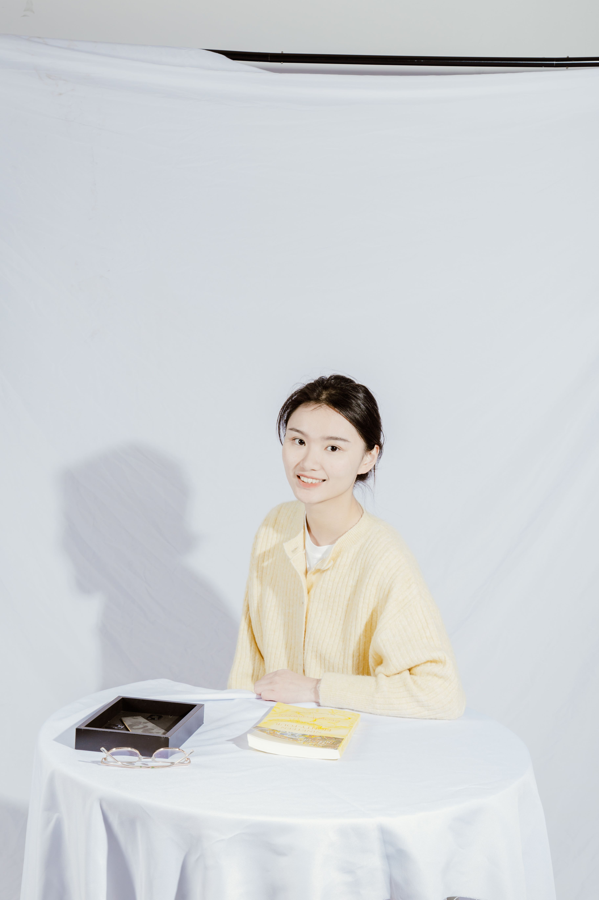

# About Me

Hi, I’m **Fupei Guo (郭馥佩)**.

I am currently a PhD student in the Department of Systems Engineering at the **University of Louisiana at Lafayette (ULL)**.

## Research Interests

My research interests lie in **Medical Image Processing** and **Semantic Communication**.

## Educations

- Ph.D. Student in Systems Engineering, University of Louisiana at Lafayette (08/2023 - Present), advised by Prof. Songyang Zhang
- Master’s Degree in Electronic Information, University of Electronic Science and Technology of China (09/2020 - 06/2023)
- Bachelor’s Degree in Automation (09/2016 - 06/2020)

## Publication
* **Power Frequency Estimation Using Sine Filtering of Optimal Initial Phase**\
**Guo Fupei**, Yang Bo, Zheng Wenfeng, Liu Shan\
**Measurement** 2021

* **Sparse-view CBCT reconstruction via weighted Schatten p-norm minimization**\
Xu Congcong, Yang Bo, **Guo Fupei**, Zheng Wenfeng, Poignet Philippe\
**Optics Express** 2020
